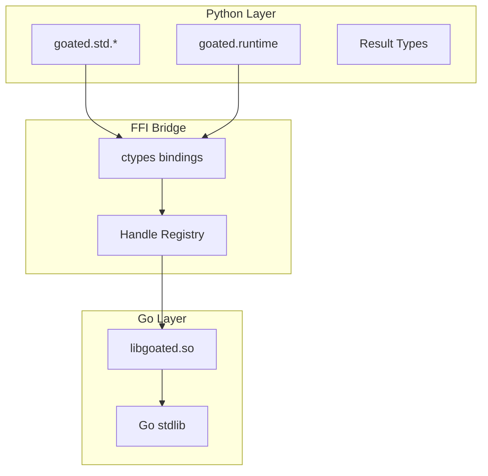
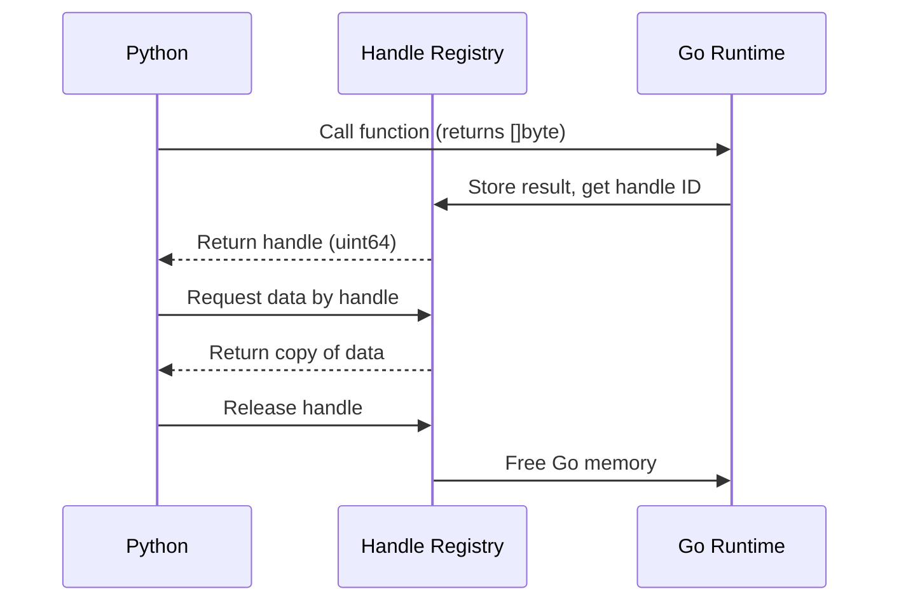
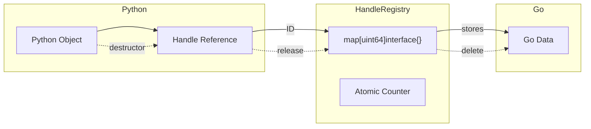
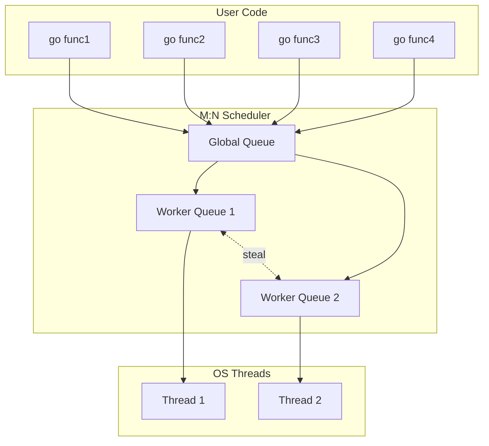
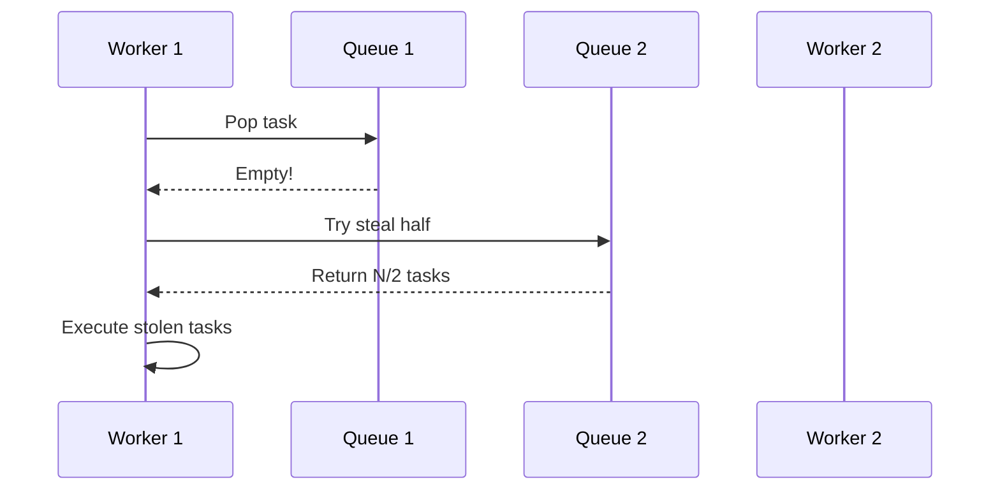
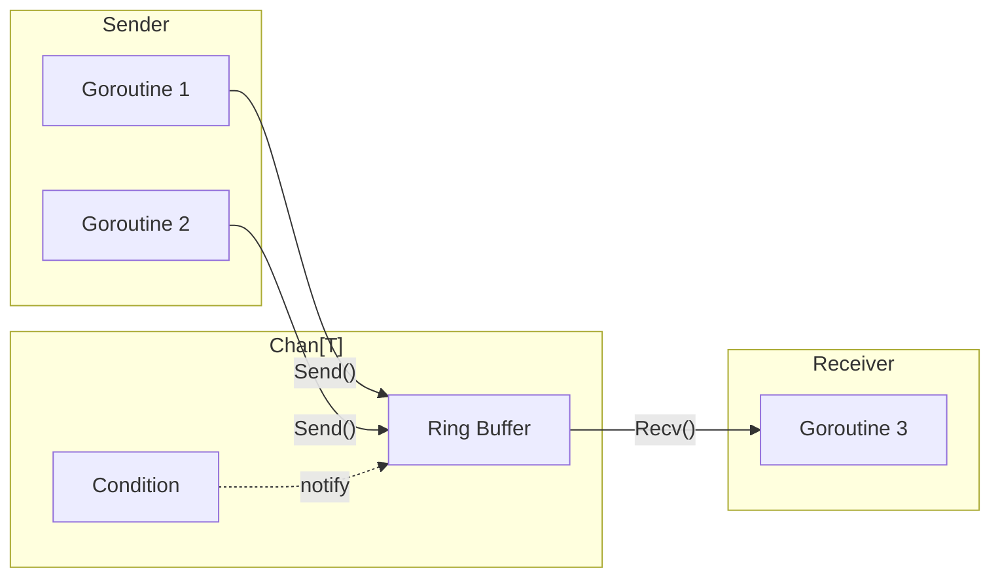
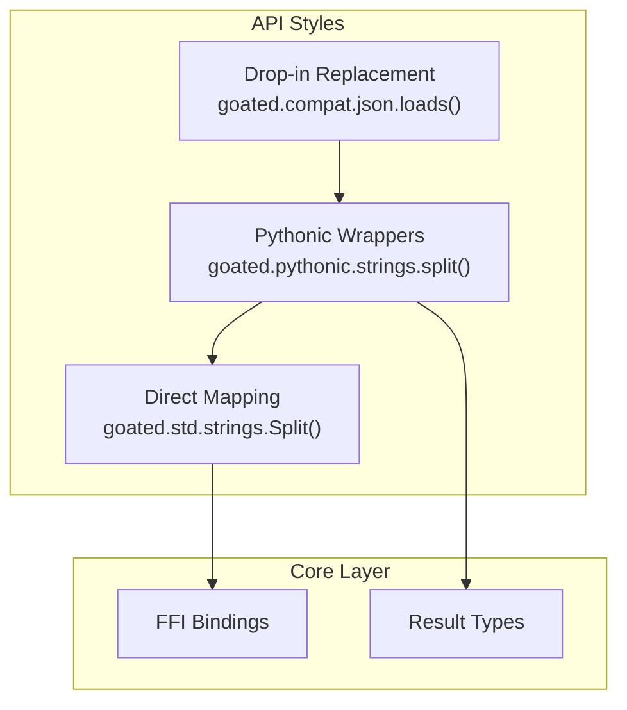
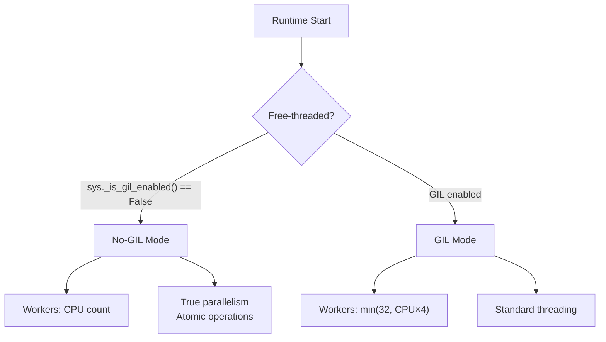
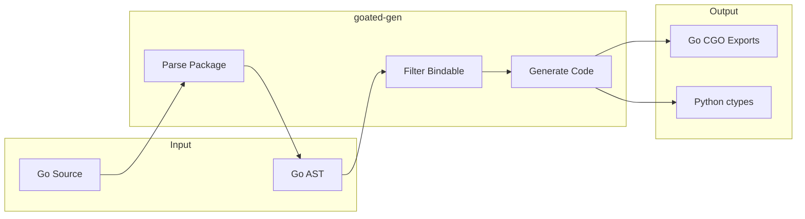

# GOATED Architecture

This document describes the internal architecture of GOATED, including the FFI design, memory management, and the M:N scheduler.

## Overview

GOATED bridges Python and Go through a carefully designed FFI layer that prioritizes safety, performance, and ease of use.



## FFI Design

### Handle-Based Approach

GOATED uses a **handle-based** FFI design instead of passing raw pointers. This ensures memory safety across the Python-Go boundary.



**Why handles instead of raw pointers?**

1. **GC Safety**: Go's garbage collector can move objects. Handles prevent dangling pointers.
2. **Lifecycle Control**: Python controls when Go memory is freed.
3. **Thread Safety**: Handle operations are atomic.
4. **Debugging**: Handles can be tracked and validated.

### Memory Management



**Lifecycle:**

1. Go function returns data → stored in registry → handle ID returned to Python
2. Python wraps handle in object with `__del__` destructor
3. When Python object is garbage collected → handle released → Go memory freed

## Concurrency Architecture

### M:N Scheduler

GOATED implements an M:N scheduler that maps M goroutines to N OS threads, inspired by Go's runtime.



### Work Stealing

When a worker's local queue is empty, it can steal work from other workers:



**Optimizations:**

- **Fast Path**: Direct submission to `ThreadPoolExecutor` (zero Python overhead)
- **Lazy Stealing**: Work stealing only activates under load imbalance
- **Batch Operations**: Reduces lock contention for bulk submissions
- **Lock-Free Counters**: Atomic task counting on free-threaded Python

### Channel Implementation

Channels provide Go-style communication between goroutines:



**Chan Optimizations (v0.1.0+):**

| Component | Before | After | Improvement |
|-----------|--------|-------|-------------|
| Buffer | `queue.Queue` | `deque` + `Condition` | 1.5x faster |
| Blocking | Queue's internal lock | Direct `Condition.wait()` | Lower latency |
| Close | Sentinel value | Boolean flag + notify_all | Cleaner semantics |

## API Layers

GOATED provides three API styles to match different preferences:



| Style | Naming | Returns | Use Case |
|-------|--------|---------|----------|
| Direct | Go PascalCase | Go types | Maximum control, Go familiarity |
| Pythonic | snake_case | `Result[T, E]` | Idiomatic Python, explicit errors |
| Compat | Python stdlib | Python types | Drop-in replacement |

## Free-Threaded Python Support

GOATED automatically detects and optimizes for Python 3.13t (free-threaded/no-GIL):



**Optimizations for free-threaded Python:**

- Reduced worker count (true parallelism doesn't need oversubscription)
- Atomic operations for counters and flags
- Lock-free fast paths where possible

## Code Generation

GOATED includes a code generator that automatically creates bindings from Go source:



**Bindable function criteria:**

- Exported (PascalCase name)
- Parameters: basic types, slices, strings
- Returns: basic types, slices, strings, error
- No channels, interfaces, or complex structs (yet)

## Performance Characteristics

### When GOATED Wins

| Operation | Why GOATED is Faster |
|-----------|---------------------|
| JSON parsing | Go's `encoding/json` is highly optimized |
| Hashing (SHA256) | Go's crypto uses assembly optimizations |
| Compression | Go's gzip/zip use efficient C bindings |
| String operations | Go strings are immutable, optimized |
| Regex (large text) | Go's RE2 is faster for complex patterns |

### When Python Wins

| Operation | Why Python is Faster |
|-----------|---------------------|
| Small operations | FFI overhead dominates |
| Single string ops | Python's string interning helps |
| Already-fast ops | No room for improvement |

### FFI Overhead

Each FFI call has ~1-5μs overhead. GOATED wins when:

```
Go speedup × batch size > FFI overhead
```

**Rule of thumb**: Use GOATED for operations on data > 1KB or batch operations.

## See Also

- [README.md](README.md) - Getting started guide
- [docs/std.md](docs/std.md) - API reference
- [CONTRIBUTING.md](CONTRIBUTING.md) - How to contribute
- [CHANGELOG.md](CHANGELOG.md) - Version history
